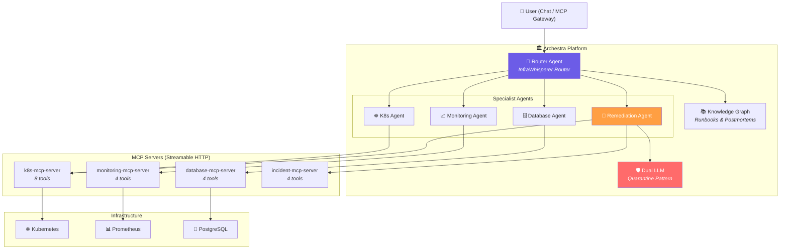

# 🏎️ InfraWhisperer

> **Conversational Infrastructure Management for SREs** — powered by [Archestra](https://archestra.ai)

*Talk to your infrastructure. Get traced answers. Safely remediate.*

[](https://archestra.ai)
[]()
[]()
[]()

---

## 💡 The Problem

SRE teams spend **40% of incident response time** just gathering context — SSHing into boxes, running kubectl, checking Grafana, querying databases, searching wikis. By the time they understand the problem, the outage has already cost thousands.

## 🎯 The Solution

InfraWhisperer lets you **ask questions in plain English** and get correlated answers from across your entire infrastructure stack — Kubernetes, Prometheus, PostgreSQL, and operational runbooks — through a single conversational interface.

```
You:   "Why is payment-service failing?"

InfraWhisperer:
  📦 K8s Agent → payment-service-5c8d3a1b2 is in CrashLoopBackOff (14 restarts)
  📈 Monitoring → Error rate spiked to 23% at 14:30, payment gateway timeout alerts firing
  🗄️ Database → 5 orders failed in last 30 min with "Payment gateway timeout"
  📚 Runbook → Matched: "Pod CrashLoopBackOff Recovery" — suggests restart + check resource limits
  
  Root Cause: Payment gateway connection pool exhausted. Recommend restart.
  ⚠️ Want me to restart the deployment? (requires confirmation)
```

---

## 🏗️ Architecture



---

## 🔐 Security Architecture — "The Lethal Trifecta"

InfraWhisperer is designed around the principle that **no single agent should have all three**: access to untrusted user input, ability to execute destructive actions, and direct tool access without validation.

| Layer | Control | Implementation |
|-------|---------|---------------|
| 🏗️ **Architecture** | Separation of Concerns | Read-only tools isolated from write tools across different agents |
| 🔒 **RBAC** | Role-Based Access | Admin/Editor/Member roles control agent access |
| 🛡️ **Dual LLM** | Quarantine Pattern | Independent LLM validates all destructive operations |
| ✅ **Confirmation** | Human-in-the-Loop | Remediation Agent requires explicit user confirmation |
| 🗄️ **SQL Safety** | Mutation Blocking | Database MCP server rejects all non-SELECT queries at the server level |
| 🔏 **PII Redaction** | Data Protection | Database Agent redacts emails, phone numbers, and names in responses |

### How agents break the trifecta:

| Agent | Has Untrusted Input? | Has Write Access? | Has Direct Tool Access? |
|-------|---------------------|-------------------|------------------------|
| Router | ✅ Yes | ❌ No | ❌ No (delegates) |
| K8s/Monitoring/DB | ✅ Yes | ❌ No (read-only) | ✅ Yes |
| Remediation | ❌ No (filtered) | ✅ Yes | ✅ Yes |

> No agent has all three capabilities. This is production-grade security by design.

---

## 🛠️ MCP Servers

### 4 Custom MCP Servers — 20 Tools Total

| Server | Port | Tools | Transport |
|--------|------|-------|-----------|
| **k8s-mcp-server** | 8001 | `list_pods` `get_pod_logs` `describe_pod` `list_deployments` `get_events` `list_nodes` `scale_deployment` `restart_deployment` | Streamable HTTP |
| **monitoring-mcp-server** | 8002 | `query_metric` `query_range` `get_alerts` `get_targets` | Streamable HTTP |
| **database-mcp-server** | 8003 | `run_query` `list_tables` `describe_table` `slow_queries` | Streamable HTTP |
| **incident-mcp-server** | 8004 | `search_runbooks` `log_incident` `list_incidents` `get_incident` | Streamable HTTP |

All servers feature:
- **Streamable HTTP transport** (production-ready, not stdio)
- **Stateless architecture** for horizontal scalability
- **Graceful DEMO_MODE fallback** when infrastructure is unavailable
- **Built with FastMCP** (MCP Python SDK)

---

## 🚀 Quick Start

### Prerequisites

- Docker Desktop
- Archestra Platform image
- LLM API key (Google Gemini / Azure OpenAI / OpenAI)

### 1. Clone & Start

```bash
git clone <repo-url>
cd infrawhisperer
docker-compose up -d
```

This launches:
- 📦 **4 MCP Servers** (ports 8001-8004)
- 🐘 **PostgreSQL** with e-commerce demo data (port 5433)
- 📊 **Prometheus** with metrics (port 9090)
- 📈 **Grafana** with dashboards (port 3001)

### 2. Start Archestra

```powershell
docker run -p 9000:9000 -p 3000:3000 `
  -e ARCHESTRA_QUICKSTART=true `
  -v /var/run/docker.sock:/var/run/docker.sock `
  -v archestra-postgres-data:/var/lib/postgresql/data `
  -v archestra-app-data:/app/data `
  archestra/platform
```

### 3. Configure Archestra

Follow the detailed [ARCHESTRA_SETUP_GUIDE.md](ARCHESTRA_SETUP_GUIDE.md) to:
1. Add your LLM API key
2. Register 4 MCP servers
3. Create the 5-agent swarm
4. Configure security policies

### 4. Chat!

Open http://localhost:3000 → **New Chat** → Select **InfraWhisperer Router** → Start asking!

---

## 🎬 Demo Scenario

InfraWhisperer ships with a **pre-built incident scenario** — a payment-service outage that cascades into failed orders:

### The Scenario
```
payment-service → CrashLoopBackOff (14 restarts)
    ↓ causes
Payment gateway timeouts → 5 failed payments in 30 min
    ↓ causes  
5 stuck orders, 2 pending orders in PostgreSQL
    ↓ detected by
Prometheus alerts firing for error rate spike
```

### Demo Script

| # | Query | What It Shows |
|---|-------|--------------|
| 1 | *"What pods are running?"* | Multi-agent routing, K8s tool usage |
| 2 | *"Why is payment-service failing?"* | Cross-agent correlation (K8s + Monitoring) |
| 3 | *"Show me failed orders from the database"* | Database queries with PII redaction |
| 4 | *"Do we have a runbook for CrashLoopBackOff?"* | Knowledge/runbook search |
| 5 | *"Restart the payment-service deployment"* | Confirmation-gated remediation + incident logging |
| 6 | *"Run this query: DROP TABLE orders;"* | SQL injection prevention |

---

## 📂 Project Structure

```
infrawhisperer/
├── mcp-servers/
│   ├── k8s-mcp-server/          # ☸️ Kubernetes management (8 tools)
│   ├── monitoring-mcp-server/   # 📈 Prometheus metrics (4 tools)
│   ├── database-mcp-server/     # 🗄️ PostgreSQL read-only (4 tools)
│   └── incident-mcp-server/     # 🚨 Runbooks & incidents (4 tools)
├── knowledge/
│   ├── runbooks/                # Operational runbooks
│   └── postmortems/             # Past incident reports
├── archestra-config/            # Agent & security configuration guides
├── demo/
│   └── seed.sql                 # E-commerce demo database
├── grafana/dashboards/          # Monitoring dashboards
├── docker-compose.yml           # Full stack orchestration
├── ARCHESTRA_SETUP_GUIDE.md     # Detailed setup instructions
└── DEMO_SCRIPT.md               # Step-by-step demo walkthrough
```

---

## 🏆 Archestra Features Used

| Feature | How We Use It |
|---------|--------------|
| **MCP Registry** | 4 remote MCP servers registered with tool discovery |
| **MCP Orchestrator** | Router agent delegates to specialist agents |
| **Agents (A2A)** | 5-agent swarm with sub-agent delegation |
| **Dual LLM** | Quarantine pattern validates destructive operations |
| **RBAC** | Role-based access controls agent permissions |
| **Dynamic Tool Access** | Tools assigned per-agent based on responsibility |
| **Tool Policies** | Read-only tools set to "Allow always", write tools gated |
| **MCP Gateway** | External MCP clients can connect to InfraWhisperer |
| **Observability** | Grafana dashboards + Prometheus metrics |
| **Cost Controls** | Per-organization spending limits |

---

## 🧑‍💻 Tech Stack

| Component | Technology |
|-----------|-----------|
| MCP Servers | Python 3.11 + FastMCP (MCP SDK) |
| Transport | Streamable HTTP (production-grade) |
| Orchestration | Archestra Platform |
| Database | PostgreSQL 16 |
| Monitoring | Prometheus + Grafana |
| Container Runtime | Docker + Docker Compose |
| LLM | Google Gemini / Azure OpenAI / OpenAI |

---

## 📜 License

MIT
